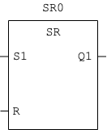

## Introduction

This function block maintains its output in one of two stable states `TRUE` or `FALSE`.
The output can be set or reset by applying a `TRUE` signal to the `Set` or `Reset` inputs.
If both inputs are `TRUE` the output is `TRUE`.



## VAR_INPUT

```
VAR_INPUT
    S1 : BOOL;
    R  : BOOL;
END_VAR
```

## VAR_OUTPUT

```
VAR_OUTPUT
    Q1 : BOOL;
END_VAR
```
Internal implementation:

```
Q1 := S1 OR ((NOT R) AND Q1);
```

## Pinout Description

| Pin Name | Signal | Data Type | Description                                                    |
|----------|--------|-----------|----------------------------------------------------------------|
| `S`      | Input  | `BOOL`    | Set. This input puts the output in `TRUE` state.               |
| `R1`     | Input  | `BOOL`    | Reset (dominant). This input puts the output in `FALSE` state. |
| `Q1`     | Output | `BOOL`    | Q. This is the output.                                         |

## Truth Table

| S1 | R |       Q1       | Description                    |
|----|---|----------------|--------------------------------|
|  0 | 0 | Q<sub>-1</sub> | Q retains its previous state   |
|  0 | 1 |        0       | Q is `FALSE`                   |
|  1 | 0 |        1       | Q is `TRUE`                    |
|  1 | 1 |        1       | Q is `TRUE`                    |

## Time Diagram


